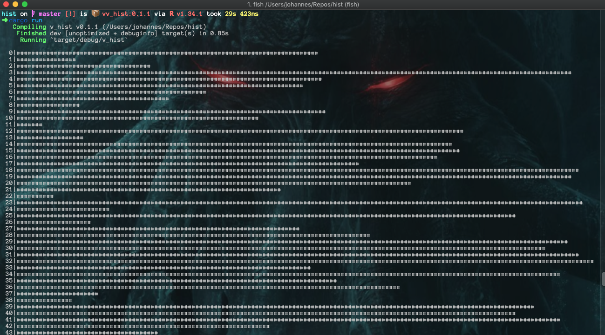

# hist

Terminal histograms

----------------


```rust
extern crate v_hist;
extern crate rand;

use rand::Rng;

fn main() {
    let mut h = v_hist::init();
    let mut rng = rand::thread_rng();

    // h.max_width = 50;

    for x in 0..200 {
        h.add_entry(format!("{}", x), rng.gen_range(0, 3000)) ;
    }

    h.draw();
}
```

and Voila





----------------

Credit where credit is due: https://github.com/JustinMMiller/CUtils
