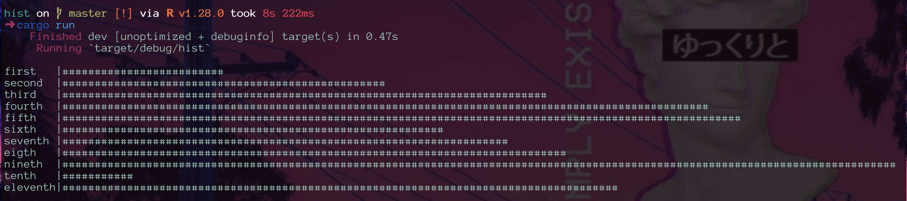

# hist

Terminal histograms

----------------


```rust
extern crate hist;

fn main() {
    let mut h = hist::init();

    h.add_entry("first".to_string(), 100);
    h.add_entry("second".to_string(), 200);
    h.add_entry("third".to_string(), 300);
    h.add_entry("fourth".to_string(), 400);
    h.add_entry("fifth".to_string(), 420);
    h.add_entry("sixth".to_string(), 235);
    h.add_entry("seventh".to_string(), 275);
    h.add_entry("eigth".to_string(), 310);
    h.add_entry("nineth".to_string(), 560);
    h.add_entry("tenth".to_string(), 41);
    h.add_entry("eleventh".to_string(), 341);


    h.draw();
}
```

and Voila





----------------

Credit where credit is due: https://github.com/JustinMMiller/CUtils
